# Eyes Open 

### Mafia/Werewolf/ToS inspired web based game

---

# Table of contents

  ### Game
<!-- - [Eyes Open ](#eyes-open-)
    - [Mafia/Werewolf/ToS inspired web based game](#mafiawerewolftos-inspired-web-based-game) -->
  - [Link to website](#link-to-website)
  - [Game description & objective](#game-description--objective)
  - [Requirements](#requirements)
  - [Role info](#role-info)
  <!-- - [Dependencies](#dependencies)
  - [Install and build](#install-and-build)
  - [Assets](#assets)
  - [Notes](#notes) -->
### Project
- [Dependencies](#dependencies)
- [Install and build](#install-and-build)
### Miscellaneous info
- [Assets](#assets)
- [Notes](#notes)

---

## Link to website
### https://eyesopen.herokuapp.com/
Enjoy ^-^


## Game description & objective
 A peaceful and beautiful town with its good inhabitants, is struck by evildoers and "anti-heroes", which are trying to either sabotage, kill or trick the town. There are different roles, each apart of three different teams (Good, Evil or Neutral). Each role has a specific ability and a given goal, to either win with their team, or win by themselves. 
 

## Requirements
- Minimum 3 players

## Role info


<br>


<br>


## Role cards
<p>

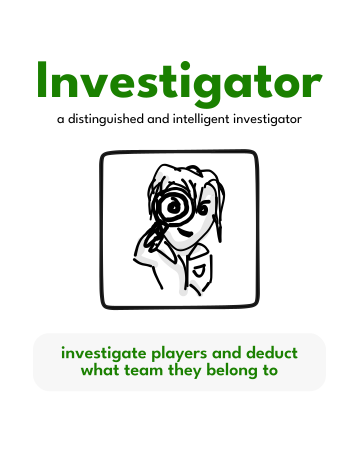
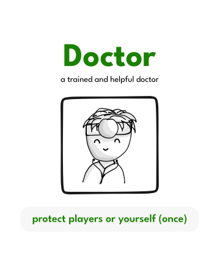
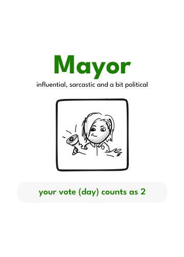
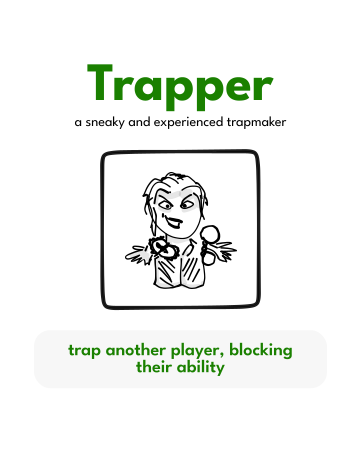
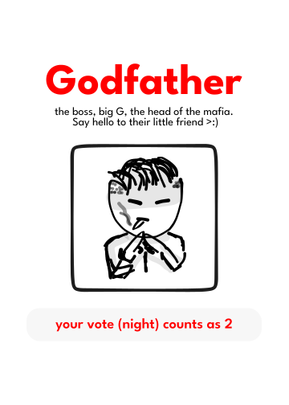
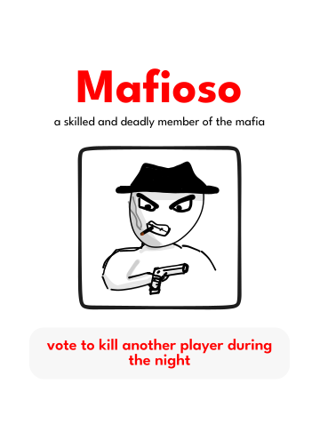
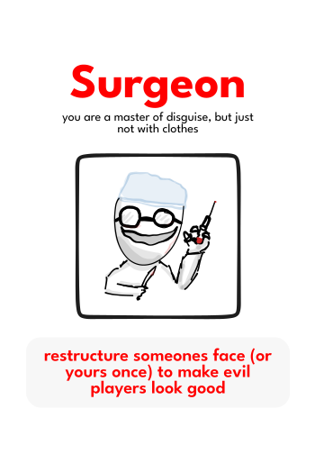
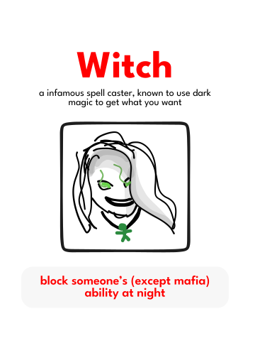
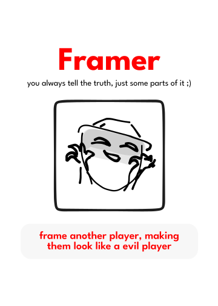
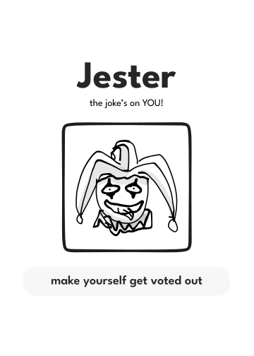

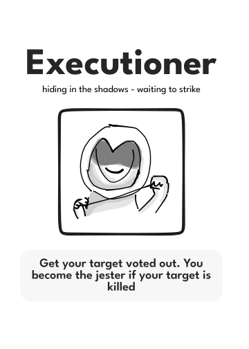

</p>


<!-- ### Roles


---
## Dependencies
```json
"dependencies": {
    "express": "^4.18.1",
    "express-session": "^1.17.3",
    "randomstring": "^1.2.2",
    "socket.io": "^4.5.1",
    "socket.io-client": "^4.5.1"
  }
```

## Install and build

```
npm i
npm build
```
---

## Assets


**Illustrations** <br> Beatriz Ines Avila Cutiño

**Game design** <br> Petrus Matiros

**Visual UI elements** <br> Petrus Matiros

## Notes

This game is in it's alpha phase - still in development :D


