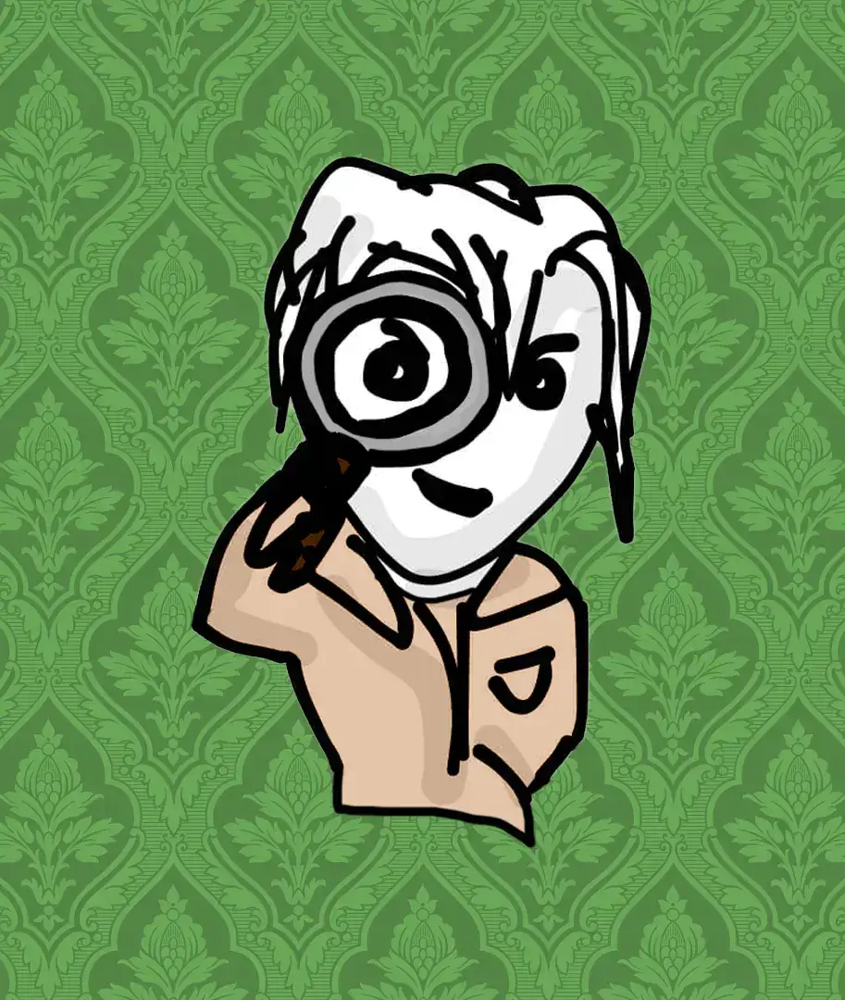
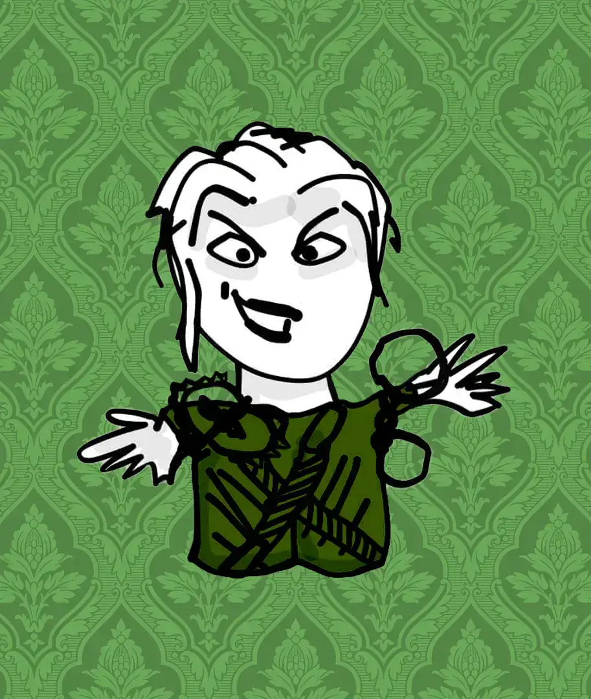
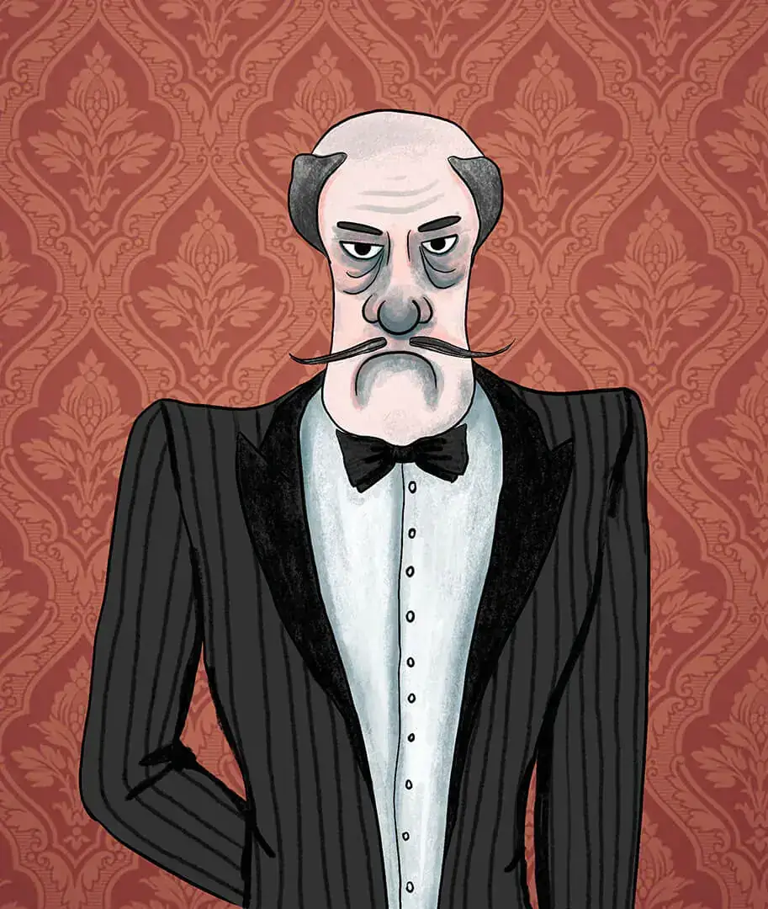
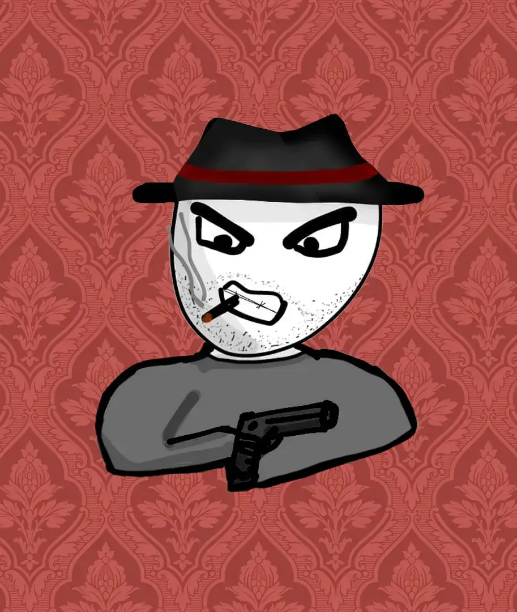
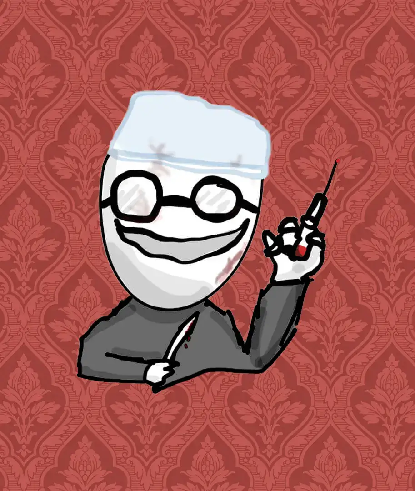
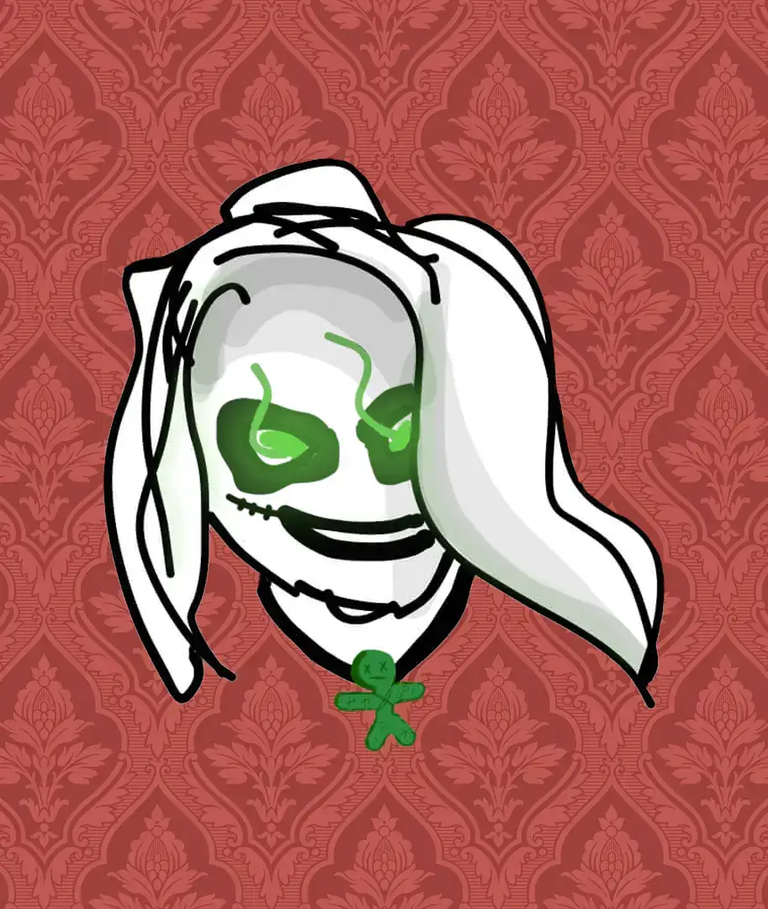
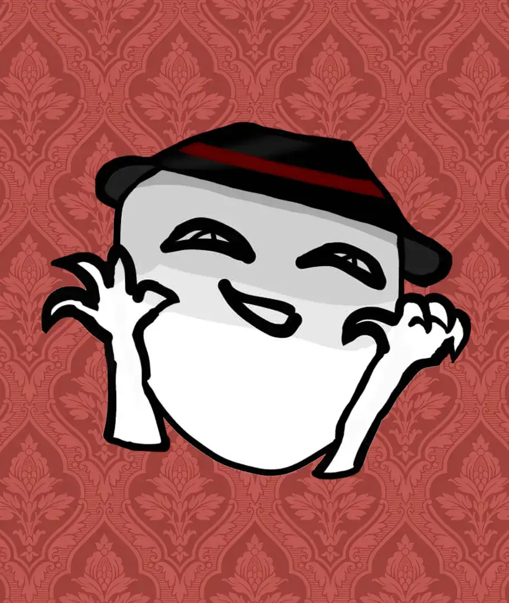
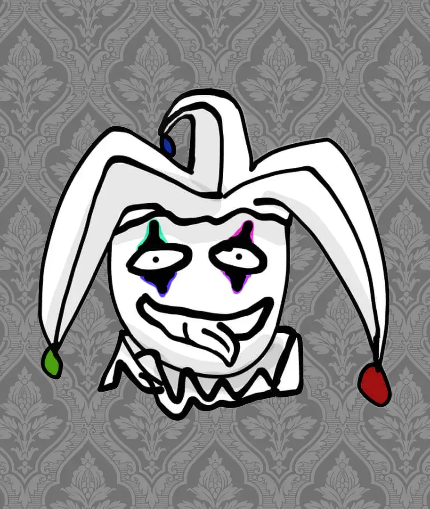
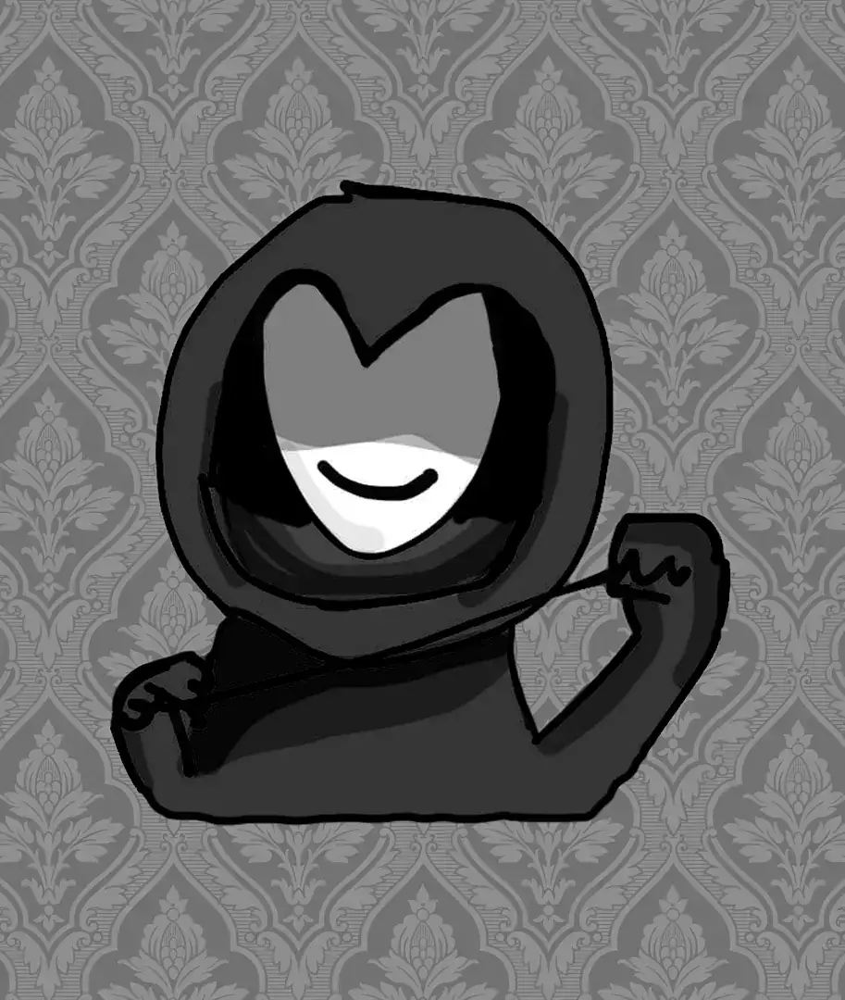
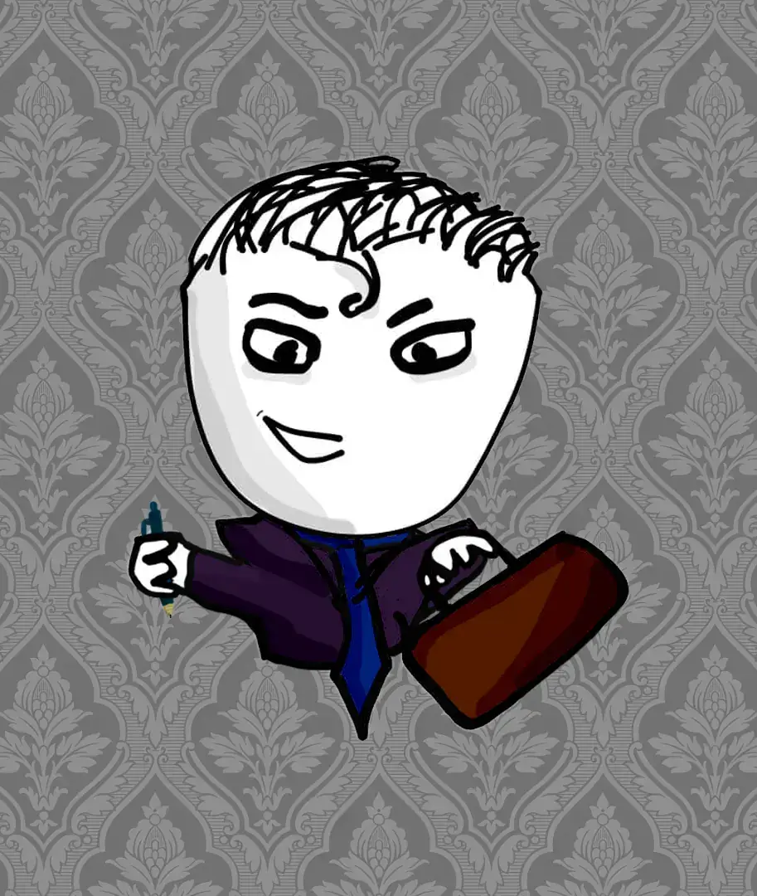

# Eyes Open 

### Mafia/Werewolf/ToS inspired web based game

---

# Table of contents
<!-- - [Eyes Open ](#eyes-open-)
    - [Mafia/Werewolf/ToS inspired web based game](#mafiawerewolftos-inspired-web-based-game)
- [Table of contents](#table-of-contents) -->
  ### Game
  - [Link to website](#link-to-website)
  - [Game description & objective](#game-description--objective)
  - [Requirements](#requirements)
  - [Role cards](#role-cards)
    - [Good](#good)
    - [Evil](#evil)
    - [Neutral](#neutral)
  ### Project
  - [Dependencies](#dependencies)
  - [Install and build](#install-and-build)
  ### Miscellaneous info
  - [Assets](#assets)
  - [Notes](#notes)

---

## Link to website
<!-- #### TBD -->
 https://eyesopen.ml
 
 Enjoy ^-^


## Game description & objective
 A peaceful and beautiful town with its good inhabitants, is struck by evildoers and "anti-heroes", which are trying to either sabotage, kill or trick the town. There are different roles, each apart of three different teams (Good, Evil or Neutral). Each role has a specific ability and a given goal, to either win with their team, or win by themselves. 
 

## Requirements
- Minimum 3 players

## Role cards

### Good
<p>





</p>

### Evil
<p>





</p>

### Neutral
<p>




</p>

---

## Dependencies
```json
"dependencies": {
    "express": "^4.18.1",
    "express-session": "^1.17.3",
    "randomstring": "^1.2.2",
    "socket.io": "^4.5.1",
    "socket.io-client": "^4.5.1"
  }
```

## Install and build

```
npm i
npm build
```
---

## Assets


**Design & Illustrations** <br> Beatriz Ines Avila Cutiño

**Code & Design** <br> Petrus Matiros

**Emojis** <br> <a href="https://openmoji.org/library/" target="_blank">Openmoji</a>

**Icons** <br> <a href="https://www.untitledui.com/icons" target="_blank">Untitled UI</a>

**BGM & SFX**
<br>
<a href="https://freesound.org/people/tyops/sounds/423208/" target="_blank">"Suspense Mystery Entry"</a> by Tyops of <a href="https://www.freesound.org" target="_blank">Freesound.org</a>
<br>
<a href="https://freesound.org/people/Sheyvan/sounds/470083/" target="_blank">"Music: Orchestral Victory Fanfare"</a> by Sheyvan of <a href="https://www.freesound.org" target="_blank">Freesound.org</a>
<br>
<a href="https://freesound.org/people/ryusa/sounds/531132/" target="_blank">"Bass drum snare roll victorious victory positive percussion.wav"</a> by ryusa of <a href="https://www.freesound.org" target="_blank">Freesound.org</a>
<br>
<a href="https://freesound.org/people/LittleRobotSoundFactory/sounds/270467/" target="_blank">"Jingle_Lose_00.wav"</a> by LittleRobotSoundFactory of <a href="https://www.freesound.org" target="_blank">Freesound.org</a>
<br>
<a href="https://freesound.org/people/InspectorJ/sounds/384188/" target="_blank">"Rooster, Crowing, A.wav"</a> by InspectorJ of <a href="https://www.freesound.org" target="_blank">Freesound.org</a>
<br>
<a href="https://freesound.org/people/PhonosUPF/sounds/499699/" target="_blank">"howling"</a> by PhonosUPF of <a href="https://www.freesound.org" target="_blank">Freesound.org</a>
<br>
<a href="https://freesound.org/people/greenvwbeetle/sounds/328117/" target="_blank">"Pop 8"</a> by greenvwbeetle of <a href="https://www.freesound.org" target="_blank">Freesound.org</a>
<br>
<a href="https://freesound.org/people/igroglaz/sounds/633208/" target="_blank">"Old Church Bell (no noise)"</a> by igroglaz of <a href="https://www.freesound.org" target="_blank">Freesound.org</a>


## Notes

This game is in it's production phase - still in development :D

