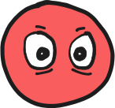

# Eyes Open 

### Mafia/Werewolf/ToS inspired web based game

---

# Table of contents
<!-- - [Eyes Open ](#eyes-open-)
    - [Mafia/Werewolf/ToS inspired web based game](#mafiawerewolftos-inspired-web-based-game)
- [Table of contents](#table-of-contents) -->
  ### Game
  - [Link to website](#link-to-website)
  - [Game description & objective](#game-description--objective)
  - [Requirements](#requirements)
  - [Role cards](#role-cards)
    - [Good](#good)
    - [Evil](#evil)
    - [Neutral](#neutral)
  ### Project
  - [Dependencies](#dependencies)
  - [Install and build](#install-and-build)
  ### Miscellaneous info
  - [Assets](#assets)
  - [Notes](#notes)

---

## Link to website
<!-- #### TBD -->
 https://eyesopen.ml
 
 Enjoy ^-^


## Game description & objective
 A peaceful and beautiful town with its good inhabitants, is struck by evildoers and "anti-heroes", which are trying to either sabotage, kill or trick the town. There are different roles, each apart of three different teams (Good, Evil or Neutral). Each role has a specific ability and a given goal, to either win with their team, or win by themselves. 
 

## Requirements
- Minimum 3 players

## Role cards

### Good
<p>


</p>

### Evil
<p>


</p>

### Neutral
<p>


</p>


<!-- <div style="display:flex; justify-content:center; align-items:center; flex-direction:column; gap:1.5rem;">
  
  <div style="display:flex; justify-content:center; align-items:center; flex-direction:row; font-size: 1.5rem; font-weight: 700">Good</div>
  <div style="display:flex; justify-content:center; align-items:center; flex-direction:row; gap:0.5rem;">
    <div style="display:flex; justify-content:center; align-items: center; flex-direction:column; width:20%; padding:1rem; border-radius:1rem; background-color:hsl(0,0%,100%); color:hsl(0,0%,0%); font-weight:500; ">
    
    Villager
    </div>
    <div style="display:flex; justify-content:center; align-items: center; flex-direction:column; width:20%; padding:1rem; border-radius:1rem; background-color:hsl(0,0%,100%); color:hsl(0,0%,0%); font-weight:500; ">
    
    Investigator
    </div>
    <div style="display:flex; justify-content:center; align-items: center; flex-direction:column; width:20%; padding:1rem; border-radius:1rem; background-color:hsl(0,0%,100%); color:hsl(0,0%,0%); font-weight:500; ">
    
    Doctor
    </div>
    <div style="display:flex; justify-content:center; align-items: center; flex-direction:column; width:20%; padding:1rem; border-radius:1rem; background-color:hsl(0,0%,100%); color:hsl(0,0%,0%); font-weight:500; ">
    
    Mayor
    </div>
    <div style="display:flex; justify-content:center; align-items: center; flex-direction:column; width:20%; padding:1rem; border-radius:1rem; background-color:hsl(0,0%,100%); color:hsl(0,0%,0%); font-weight:500 ">
    
    Trapper
    </div>
  </div>

  <div style="display:flex; justify-content:center; align-items:center; flex-direction:row; font-size: 1.5rem; font-weight: 700">Evil</div>
  <div style="display:flex; justify-content:center; align-items:center; flex-direction:row; gap:0.5rem;">
    <div style="display:flex; justify-content:center; align-items: center; flex-direction:column; width:20%; padding:1rem; border-radius:1rem; background-color:hsl(0,0%,100%); color:hsl(0,0%,0%); font-weight:500; ">
    
    Godfather
    </div>
    <div style="display:flex; justify-content:center; align-items: center; flex-direction:column; width:20%; padding:1rem; border-radius:1rem; background-color:hsl(0,0%,100%); color:hsl(0,0%,0%); font-weight:500; ">
    
    Mafioso
    </div>
    <div style="display:flex; justify-content:center; align-items: center; flex-direction:column; width:20%; padding:1rem; border-radius:1rem; background-color:hsl(0,0%,100%); color:hsl(0,0%,0%); font-weight:500; ">
    
    Surgeon
    </div>
    <div style="display:flex; justify-content:center; align-items: center; flex-direction:column; width:20%; padding:1rem; border-radius:1rem; background-color:hsl(0,0%,100%); color:hsl(0,0%,0%); font-weight:500; ">
    
    Witch
    </div>
    <div style="display:flex; justify-content:center; align-items: center; flex-direction:column; width:20%; padding:1rem; border-radius:1rem; background-color:hsl(0,0%,100%); color:hsl(0,0%,0%); font-weight:500; ">
    
    Framer
    </div>
  </div>
  <div style="display:flex; justify-content:center; align-items:center; flex-direction:row; font-size: 1.5rem; font-weight: 700">Neutral</div>
  <div style="display:flex; justify-content:center; align-items:center; flex-direction:row; gap:0.5rem;">
    <div style="display:flex; justify-content:center; align-items: center; flex-direction:column; width:20%; padding:1rem; border-radius:1rem; background-color:hsl(0,0%,100%); color:hsl(0,0%,0%); font-weight:500; ">
    
    Jester
    </div>
    <div style="display:flex; justify-content:center; align-items: center; flex-direction:column; width:20%; padding:1rem; border-radius:1rem; background-color:hsl(0,0%,100%); color:hsl(0,0%,0%); font-weight:500; ">
    
    Serial Killer
    </div>
    <div style="display:flex; justify-content:center; align-items: center; flex-direction:column; width:20%; padding:1rem; border-radius:1rem; background-color:hsl(0,0%,100%); color:hsl(0,0%,0%); font-weight:500; ">
    
    Executioner
    </div>
    <div style="display:flex; justify-content:center; align-items: center; flex-direction:column; width:20%; padding:1rem; border-radius:1rem; background-color:hsl(0,0%,100%); color:hsl(0,0%,0%); font-weight:500; ">
    
    Lawyer
    </div>
  </div>
</div> -->


---
## Dependencies
```json
"dependencies": {
    "express": "^4.18.1",
    "express-session": "^1.17.3",
    "randomstring": "^1.2.2",
    "socket.io": "^4.5.1",
    "socket.io-client": "^4.5.1"
  }
```

## Install and build

```
npm i
npm build
```
---

## Assets


**Design & Illustrations** <br> Beatriz Ines Avila Cutiño

**Code & Design** <br> Petrus Matiros

**Emojis** <br> <a href="https://openmoji.org/library/" target="_blank">Openmoji</a>

**Icons** <br> <a href="https://www.untitledui.com/icons" target="_blank">Untitled UI</a>

## Notes

This game is in it's production phase - still in development :D

